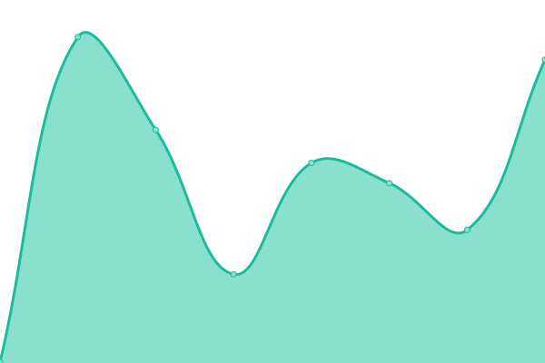
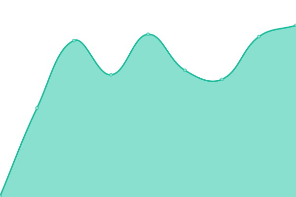
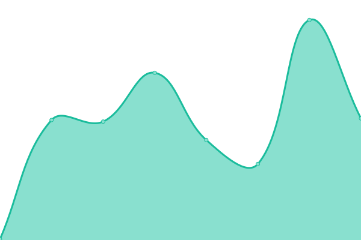
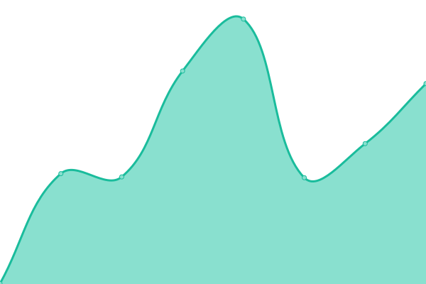
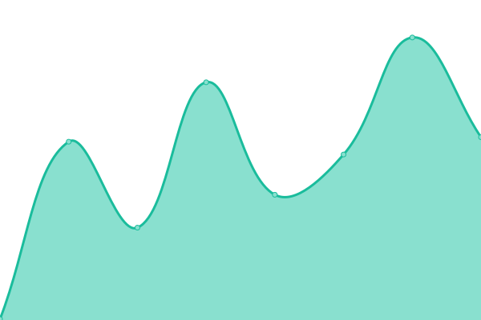
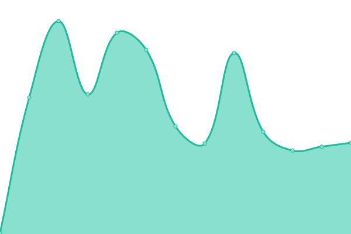
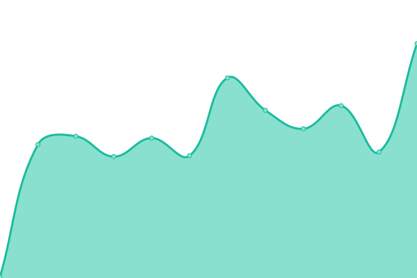
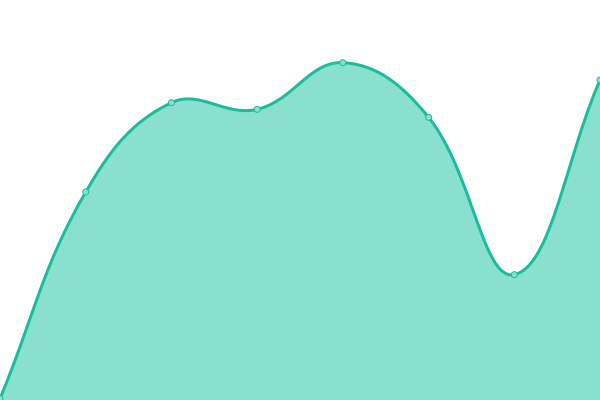
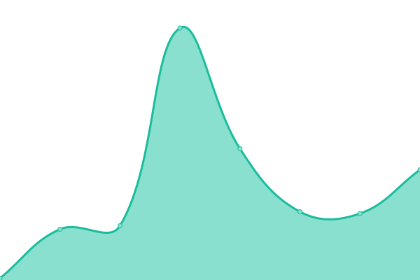

# [📈 Live Status](https://up.zombie.technology): <!--live status--> **🟧 Partial outage**

This repository contains the open-source uptime monitor and status page for [L1kw1d](https://jprovo.st), powered by [Upptime](https://github.com/upptime/upptime).

With [Upptime](https://upptime.js.org), you can get your own unlimited and free uptime monitor and status page, powered entirely by a GitHub repository. We use [Issues](https://github.com/l1kw1d/webuptime/issues) as incident reports, [Actions](https://github.com/l1kw1d/webuptime/actions) as uptime monitors, and [Pages](https://up.zombie.technology) for the status page.

<!--start: status pages-->
<!-- This summary is generated by Upptime (https://github.com/upptime/upptime) -->
<!-- Do not edit this manually, your changes will be overwritten -->
<!-- prettier-ignore -->
| URL | Status | History | Response Time | Uptime |
| --- | ------ | ------- | ------------- | ------ |
|  [JProvost - my website](https://jprovo.st) | 🟩 Up | [j-provost-my-website.yml](https://github.com/l1kw1d/webuptime/commits/HEAD/history/j-provost-my-website.yml) | 

 281ms
     
 | 

<a href="https://up.zombie.technology/history/j-provost-my-website">100.00%</a>
    

|  [FabConcept3D](https://fabconcept3d.com) | 🟩 Up | [fab-concept3-d.yml](https://github.com/l1kw1d/webuptime/commits/HEAD/history/fab-concept3-d.yml) | 

 2139ms
     
 | 

<a href="https://up.zombie.technology/history/fab-concept3-d">100.00%</a>
    

|  [Styll Design](https://styll.design) | 🟩 Up | [styll-design.yml](https://github.com/l1kw1d/webuptime/commits/HEAD/history/styll-design.yml) | 

 294ms
     
 | 

<a href="https://up.zombie.technology/history/styll-design">100.00%</a>
    

|  [MiniCasa](https://minicasa.design) | 🟩 Up | [mini-casa.yml](https://github.com/l1kw1d/webuptime/commits/HEAD/history/mini-casa.yml) | 

 279ms
     
 | 

<a href="https://up.zombie.technology/history/mini-casa">100.00%</a>
    

|  [CemaTools](https://cematools.com/) | 🟩 Up | [cema-tools.yml](https://github.com/l1kw1d/webuptime/commits/HEAD/history/cema-tools.yml) | 

 160ms
     
 | 

<a href="https://up.zombie.technology/history/cema-tools">100.00%</a>
    

|  [Metallia](https://www.metallia.ca/) | 🟩 Up | [metallia.yml](https://github.com/l1kw1d/webuptime/commits/HEAD/history/metallia.yml) | 

 468ms
     
 | 

<a href="https://up.zombie.technology/history/metallia">100.00%</a>
    

|  [JoeVee](https://joevee.ca) | 🟩 Up | [joe-vee.yml](https://github.com/l1kw1d/webuptime/commits/HEAD/history/joe-vee.yml) | 

 122ms
     
 | 

<a href="https://up.zombie.technology/history/joe-vee">100.00%</a>
    

|  [Panel ZST](https://hq.bunkers.co:2083) | 🟥 Down | [panel-zst.yml](https://github.com/l1kw1d/webuptime/commits/HEAD/history/panel-zst.yml) | 

 0ms
     
 | 

<a href="https://up.zombie.technology/history/panel-zst">100.00%</a>
    

|  JP - Serveur de courrier | 🟥 Down | [jp-serveur-de-courrier.yml](https://github.com/l1kw1d/webuptime/commits/HEAD/history/jp-serveur-de-courrier.yml) | 

 0ms
     
 | 

<a href="https://up.zombie.technology/history/jp-serveur-de-courrier">100.00%</a>
    

|  Control Threats Informations Panel | 🟥 Down | [control-threats-informations-panel.yml](https://github.com/l1kw1d/webuptime/commits/HEAD/history/control-threats-informations-panel.yml) | 

 0ms
     
 | 

<a href="https://up.zombie.technology/history/control-threats-informations-panel">100.00%</a>
    

|  OPS! Anti-Phishing | 🟥 Down | [ops-anti-phishing.yml](https://github.com/l1kw1d/webuptime/commits/HEAD/history/ops-anti-phishing.yml) | 

 0ms
     
 | 

<a href="https://up.zombie.technology/history/ops-anti-phishing">100.00%</a>
    

|  OPS! Prevention | 🟥 Down | [ops-prevention.yml](https://github.com/l1kw1d/webuptime/commits/HEAD/history/ops-prevention.yml) | 

 0ms
     
 | 

<a href="https://up.zombie.technology/history/ops-prevention">100.00%</a>
    

|  OPS! Cortex | 🟥 Down | [ops-cortex.yml](https://github.com/l1kw1d/webuptime/commits/HEAD/history/ops-cortex.yml) | 

 0ms
     
 | 

<a href="https://up.zombie.technology/history/ops-cortex">100.00%</a>
    

|  Laboratoire Anti-Menace | 🟩 Up | [laboratoire-anti-menace.yml](https://github.com/l1kw1d/webuptime/commits/HEAD/history/laboratoire-anti-menace.yml) | 

 146ms
     
 | 

<a href="https://up.zombie.technology/history/laboratoire-anti-menace">100.00%</a>
    

|  [WiFi QR](https://wifi.pin.plus) | 🟩 Up | [wi-fi-qr.yml](https://github.com/l1kw1d/webuptime/commits/HEAD/history/wi-fi-qr.yml) | 

 281ms
     
 | 

<a href="https://up.zombie.technology/history/wi-fi-qr">100.00%</a>
    

|  BTC Server | 🟥 Down | [btc-server.yml](https://github.com/l1kw1d/webuptime/commits/HEAD/history/btc-server.yml) | 

 0ms
     
 | 

<a href="https://up.zombie.technology/history/btc-server">100.00%</a>
    

|  Local Breach | 🟥 Down | [local-breach.yml](https://github.com/l1kw1d/webuptime/commits/HEAD/history/local-breach.yml) | 

 0ms
     
 | 

<a href="https://up.zombie.technology/history/local-breach">100.00%</a>
    

|  Virtual Center | 🟥 Down | [virtual-center.yml](https://github.com/l1kw1d/webuptime/commits/HEAD/history/virtual-center.yml) | 

 0ms
     
 | 

<a href="https://up.zombie.technology/history/virtual-center">100.00%</a>
    

|  Huggins | 🟥 Down | [huggins.yml](https://github.com/l1kw1d/webuptime/commits/HEAD/history/huggins.yml) | 

 157ms
     
 | 

<a href="https://up.zombie.technology/history/huggins">100.00%</a>
    

<!--end: status pages-->

[** Status website →**](https://up.zombie.technology)

## 📄 License

- Powered by: [Upptime](https://github.com/upptime/upptime)
- Code: [MIT](./LICENSE) © [L1kw1d](https://jprovo.st)
- Data in the `./history` directory: [Open Database License](https://opendatacommons.org/licenses/odbl/1-0/)

## 
