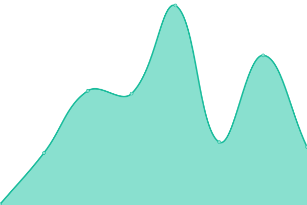

# [📈 Live Status](https://up.zombie.technology): <!--live status--> **🟩 All systems operational**

This repository contains the open-source uptime monitor and status page for [L1kw1d](https://jprovo.st), powered by [Upptime](https://github.com/upptime/upptime).

With [Upptime](https://upptime.js.org), you can get your own unlimited and free uptime monitor and status page, powered entirely by a GitHub repository. We use [Issues](https://github.com/l1kw1d/webuptime/issues) as incident reports, [Actions](https://github.com/l1kw1d/webuptime/actions) as uptime monitors, and [Pages](https://up.zombie.technology) for the status page.

<!--start: status pages-->
<!-- This summary is generated by Upptime (https://github.com/upptime/upptime) -->
<!-- Do not edit this manually, your changes will be overwritten -->
<!-- prettier-ignore -->
| URL | Status | History | Response Time | Uptime |
| --- | ------ | ------- | ------------- | ------ |
|  [Zombie Technology](https://zombie.technology) | 🟩 Up | [zombie-technology.yml](https://github.com/l1kw1d/webuptime/commits/master/history/zombie-technology.yml) | 

 590ms
     
 | 

<a href="https://up.zombie.technology/history/zombie-technology">100.00%</a>
    

|  [JProvost - my website](https://jprovo.st) | 🟩 Up | [j-provost-my-website.yml](https://github.com/l1kw1d/webuptime/commits/master/history/j-provost-my-website.yml) | 

 205ms
     
 | 

<a href="https://up.zombie.technology/history/j-provost-my-website">100.00%</a>
    

|  [Panel ZST](https://hq.bunkers.co:2083) | 🟩 Up | [panel-zst.yml](https://github.com/l1kw1d/webuptime/commits/master/history/panel-zst.yml) | 

 323ms
     
 | 

<a href="https://up.zombie.technology/history/panel-zst">100.00%</a>
    

|  [FabConcept3D](https://fabconcept3d.com) | 🟩 Up | [fab-concept3-d.yml](https://github.com/l1kw1d/webuptime/commits/master/history/fab-concept3-d.yml) | 

 1294ms
     
 | 

<a href="https://up.zombie.technology/history/fab-concept3-d">100.00%</a>
    

|  [Styll Design](https://styll.design) | 🟩 Up | [styll-design.yml](https://github.com/l1kw1d/webuptime/commits/master/history/styll-design.yml) | 

 232ms
     
 | 

<a href="https://up.zombie.technology/history/styll-design">13.56%</a>
    

|  [MiniCasa](https://minicasa.design) | 🟩 Up | [mini-casa.yml](https://github.com/l1kw1d/webuptime/commits/master/history/mini-casa.yml) | 

 423ms
     
 | 

<a href="https://up.zombie.technology/history/mini-casa">100.00%</a>
    

|  [CemaTools](https://cematools.com) | 🟩 Up | [cema-tools.yml](https://github.com/l1kw1d/webuptime/commits/master/history/cema-tools.yml) | 

 2135ms
     
 | 

<a href="https://up.zombie.technology/history/cema-tools">100.00%</a>
    

|  [Groupe Lupien](https://groupelupien.com) | 🟩 Up | [groupe-lupien.yml](https://github.com/l1kw1d/webuptime/commits/master/history/groupe-lupien.yml) | 

 125ms
     
 | 

<a href="https://up.zombie.technology/history/groupe-lupien">100.00%</a>
    

<!--end: status pages-->

[**Visit our status website →**](https://up.zombie.technology)

## 📄 License

- Powered by: [Upptime](https://github.com/upptime/upptime)
- Code: [MIT](./LICENSE) © [L1kw1d](https://jprovo.st)
- Data in the `./history` directory: [Open Database License](https://opendatacommons.org/licenses/odbl/1-0/)
